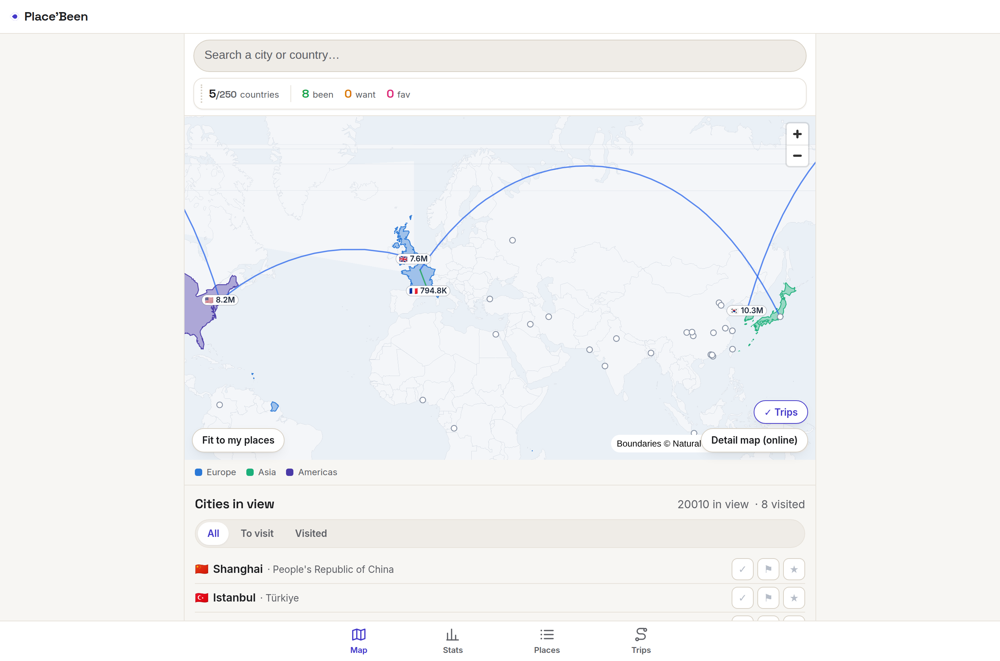
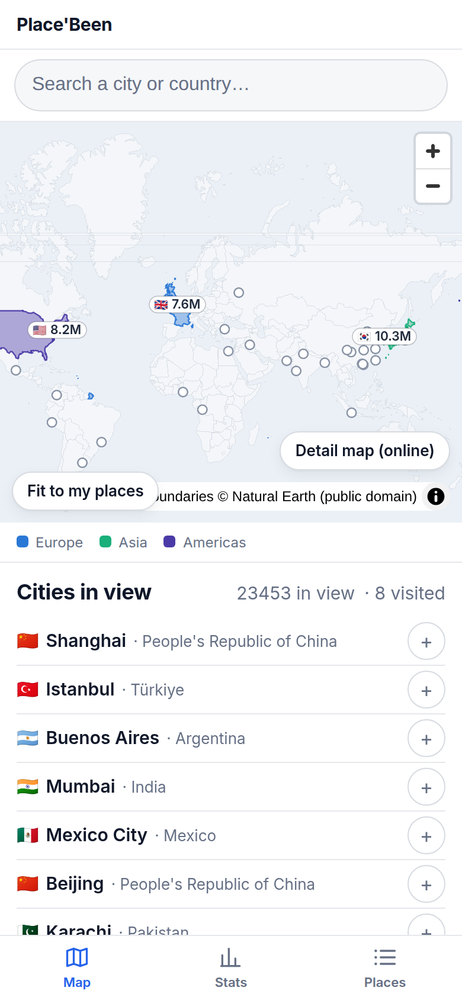
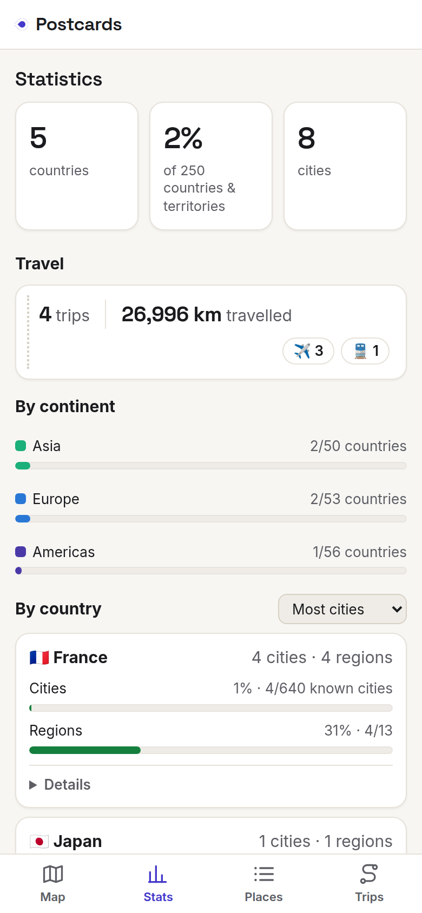
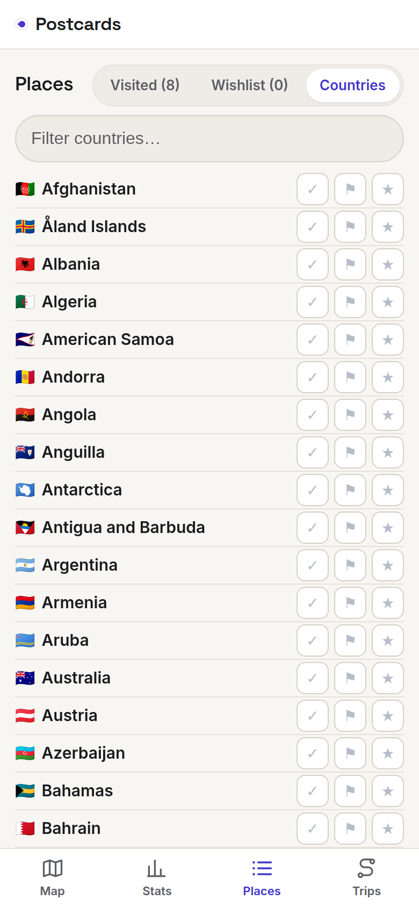

<div align="center">

# Place'Been

**Remember every place you've been — privately, offline, in a file you own.**

Search a city or country you've visited, tap to mark it, and watch your map fill
in. No account, no server, no tracking.

_Place'Been remembers where you've been — it is **not** a trip planner._



</div>

## Why Place'Been

- 🔒 **Private by default** — no telemetry, no analytics, no beacons. Nothing leaves your device unless you export it.
- ✈️ **Works fully offline** — the map and all reference data are bundled. Open it in airplane mode and everything works.
- 📄 **One portable file you own** — your whole history is a single human-readable file: back it up, diff it, or move it anywhere.
- 🌍 **Aggregator, never an author** — every place, boundary, and coordinate comes from named, openly-licensed datasets with recorded provenance. The app invents nothing.
- ⌨️ **Fast & accessible** — keyboard-first, WCAG 2.1 AA, no clutter.
- 🧩 **Zero lock-in** — no Google, no proprietary services. Open, replaceable, self-hostable components only.

## What it looks like

| Map | Stats | Places |
| :---: | :---: | :---: |
|  |  |  |
| Pan the world; the cities-in-view list updates live. | Your coverage at a glance. | Your visited list, or tick off the full country checklist. |

## Features

- **Log visits fast** — search any city or country (population-ranked, accent-insensitive) or tap it straight on the map. Optional date and note per visit. Duplicates are prevented, and every add or remove has one-tap **Undo**.
- **Offline map** — visited countries are shaded and visited cities are dots; pan and zoom the whole world with no network.
- **Coverage stats** — countries visited and **% of the world**, cities visited, and per-continent progress. For each country you see the **% of its cities** you've reached — plus the **% of its regions**, where region data is available (France today, more coming).
- **Backup & restore** — export everything to one JSON file and re-import it losslessly on any device, or export **Markdown** to share a readable summary. Imports are schema-validated and sanitized: data is parsed, never executed.

## Getting started

Requires [Node.js](https://nodejs.org) 20+ and [pnpm](https://pnpm.io).

```bash
git clone https://github.com/davd-gzl/place-been.git
cd place-been
pnpm install
pnpm --filter placebeen dev         # run the app at http://localhost:5173
```

Other useful scripts:

```bash
pnpm --filter placebeen test        # unit tests (Vitest)
pnpm --filter placebeen test:e2e    # browser e2e (Playwright): smoke, a11y, keyboard, privacy
pnpm --filter placebeen build       # production PWA build
```

## Tech stack

| Area | Choice |
| --- | --- |
| App | TypeScript + React (Vite), shipped as a self-hostable **PWA** |
| Mobile | **Capacitor** wrapper for native iOS/Android — scaffolding in place, native builds on the roadmap |
| Map | **MapLibre GL** + bundled Natural Earth geometry, behind a pluggable `MapSource` seam |
| Storage | **IndexedDB** working store; canonical portable file is **JSON** (+ Markdown export) |
| Validation | **Zod** schema; inert-data import rules |
| State | **Zustand** · **Tests**: Vitest + Playwright + axe-core |

## Reference data

All world facts come from named, openly-licensed datasets — the app authors none of them.

| Dataset | Used for | License |
| --- | --- | --- |
| ISO 3166-1 (via `i18n-iso-countries`) | Country list (~250) | MIT / public codes |
| Natural Earth (via `world-atlas`) | Country boundaries on the map | Public Domain |
| GeoNames (via `all-the-cities`) | City gazetteer — **24,323** cities, population ≥ 15k, real GeoNames IDs | CC BY 4.0 |
| `world-countries` | Country → continent grouping (baked into `continents.json`) | ODbL 1.0 |

Provenance is recorded in [`apps/placebeen/src/lib/reference/data/provenance.json`](apps/placebeen/src/lib/reference/data/provenance.json) and shown in-app.

## Project layout

```
apps/placebeen/          the app (React + TS + Vite → PWA + Capacitor)
  src/features/          visits · map · stats · backup
  src/lib/               schema (Zod) · db (IndexedDB) · store (Zustand)
                         reference (datasets) · map-source · format
  public/                bundled basemap + reference data
specs/001-cities-countries/   the MVP spec, plan, tasks, and contracts
.specify/                Spec Kit workflow, templates, and the constitution
docs/                    screenshots, UX backlog
```

This repo is a pnpm workspace; shared ecosystem packages will live in `packages/` later.

## Status & roadmap

The **cities-and-countries MVP is runnable today** — logging, the offline map, coverage stats, and
single-file backup/restore all work, covered by a unit-test suite plus Playwright e2e (smoke,
accessibility, keyboard-only, and a zero-network privacy check).

Planned next:

- **Full region data** beyond France (Natural Earth Admin 1) so per-country region coverage is exact everywhere.
- **Street-level offline basemap** (PMTiles / OpenStreetMap) behind the existing `MapSource` seam.
- **Native iOS/Android** builds via Capacitor and a device-global, cross-app **Offline Map Store**.

## How it's built & contributing

Place'Been is developed with **Spec-Driven Development** using
[GitHub Spec Kit](https://github.com/github/spec-kit): every feature flows through
`/speckit-specify` → `/speckit-plan` → `/speckit-tasks` → `/speckit-implement`. The MVP spec and
its plan live in [`specs/001-cities-countries/`](specs/001-cities-countries/), and the project's
non-negotiable principles are in
[`.specify/memory/constitution.md`](.specify/memory/constitution.md).

Issues and pull requests are welcome — please start from a spec (and keep changes aligned with the
constitution) rather than opening code-first PRs.

## License

Intended to be free for personal, non-commercial use. The formal `LICENSE` file has not been chosen
yet — until it lands, treat the code as all rights reserved.
